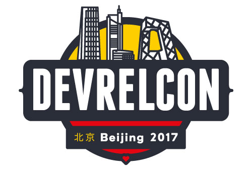

# Welcome to be a volunteer translator of DevRelCon Beijing 2017 #

## What is DevRelCon?

DevRelCon is an opportunity for everyone working in developer relations — whether you call yourself developer advocate, technical evangelist, community manager, growth hacker or something entirely different — to meet, exchange ideas and start to form a community of our own. **It has been successfully held in London and San Francisco in last two years, https://london-2016.devrel.net/ inviting people from IBM, Twitter, Google...giving speeches, while Beijing and Tokyo coming in 2017. Beijing conference will be held by DevEco in this April, at which more than 10 speakers from China, Japan, Europe or America will deliver speeches. This one-day event is for hundreds of pepople who are interested in developer relation, developer experience and developer marketing to explore the prospect of DevRel industry in China and beyond.**

## How to join?

These articles or videos are selected from previous speeches given by all community leaders of world-class corporations, well-known developer relation consultants or famous technical advocates. We expect to finish English-to-Chinese translation during this Feb.

Please choose one (or several) from **original** you'd like to translate and contact Miya to mark as **ongoing**. Pull request to send us your translation or directly send to Miya through Wechat. The translations will be **reviewed** by organizers, and then **finished** ones will be published on DevEco's platforms, official Conference website or other social media, with the name of translator specified.

## Translation progress

### 1. Original (more to be added)

* [History of developer evangelism](https://devrel.net/industry/history-developer-evangelism-josh-marinacci)
* [How to Become An Awesome Developer Evangelist When You’re Not a Developer (video)](http://cmxhub.com/developer-evangelism-non-developer/)
* [Why B2D marketing gets it wrong](https://devrel.net/opinion/why-b2d-marketing-gets-it-wrong)
* [Inaugural developer relations survey](https://devrel.net/industry/inaugural-developer-relations-survey)
* [Developer experience is user experience (video)](https://devrel.net/developer-experience/developer-experience-user-experience)
* [Measuring developer evangelism (video)](https://devrel.net/craft/measuring-developer-evangelism)

### 2. Ongoing

* [5 Predictions for the Future of Developer Evangelism](http://cmxhub.com/developer-evangelism-community-predictions-for-the-future/) (translator: Xingyun Lu)
* [Starting in Developer Relations: the non-obvious bits](https://devrel.net/craft/starting-in-developer-relations-the-non-obvious-bits) [(translator: Qianqian Xu)](https://github.com/QianXuX)
* [Hiring evangelists: five ways you’re doing it wrong](https://devrel.net/opinion/hiring-evangelists-youre-doing-it-wrong) （translator: Cheng Chen）

### 3. Review

### 4. Finished

## Letter of Thanks, invitation...

Welcome to promote developer relation in China together with us. We believe it'll be a memorable experience for yourself and we will also thank you for participating in this event as best as we can:)

